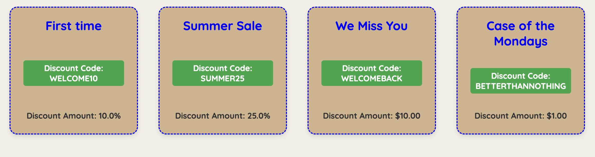

 

# Little Shop

Link to your GitHub. Consider also providing LinkedIn link

### Abstract:
This app combines work done on a previous project that included handling items, merchants, and invoices on a shop page.
This extension adds the availability of coupons

### Installation Instructions:
Installation Instructions: Clone the repository: git clone Navigate to the project directory: cd Install dependencies: npm install Start the development server: npm start The app should now be running on http://localhost:3000.

### Preview of App:

### Context:
I completed this project over the course of six days. I finished my backend in time to refactor some things I knew weren't ideal on my initial creation.

### Learning Goals:
This project involved building a full-stack application with CRUD functionality, utilizing Rails for backend development and JavaScript for frontend interaction. I used Rails migrations to create tables and establish relationships, leveraging MVC architecture to maintain a clean separation of concerns. ActiveRecord methods were key for efficient data retrieval and manipulation. I followed TDD principles with RSpec to ensure full test coverage of both data logic and API endpoints. Finally, JavaScript was used to dynamically update the frontend based on user actions, creating a seamless experience.

### Wins + Challenges:
Wins: Optimized data retrieval using ActiveRecord and developed API, which provided efficient backend functionality and improved performance.

Challenges: Manipulating the database to align with expected behavior, especially during testing and handling complex relationships, proved to be challenging at times.